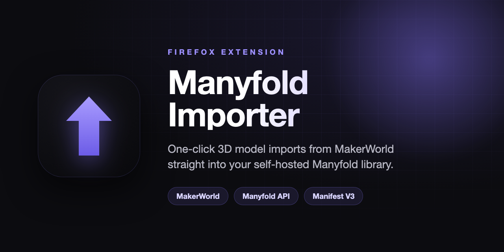

<div align="center">



# Manyfold Importer

**One-click 3D model imports from [MakerWorld](https://makerworld.com) straight into your self-hosted [Manyfold](https://manyfold.app) library.**

[](https://www.mozilla.org/firefox/)
[](https://extensionworkshop.com/documentation/develop/manifest-v3-migration-guide/)
[](LICENSE)

</div>

---

Browse a model on MakerWorld, click the toolbar icon, and the design — files, cover
image, description, tags, license, and creator — is uploaded to your own Manyfold
instance over its REST API. No downloading to disk, no re-uploading by hand, no
leaving the page. Inspired by companion extensions like NZB Donkey and Torrent Control.

## Features

- **One-click import** — scrapes the model page and sends everything to Manyfold from the toolbar popup.
- **Full metadata** — title, description, tags, SPDX-normalized license, creator, and cover image carry over.
- **Multi-profile support** — import a single profile, all profiles, or just those by the original designer.
- **Collection mode** — group a multi-profile design into its own Manyfold sub-collection, or flatten it into one model.
- **Default collection** — automatically file imports into a collection of your choice.
- **Duplicate detection** — best-effort title check so you don't import the same model twice.
- **Uses your sessions** — downloads files with your existing MakerWorld login; nothing is proxied through a third party.

> Currently supports **MakerWorld**. The scraper architecture is built to add Printables, Thingiverse, and Cults3D as drop-in modules.

## Requirements

- **Firefox 128+** (Manifest V3 / ESR baseline).
- A reachable, self-hosted **Manyfold** instance (API v0).

## Installation

> Not yet on addons.mozilla.org. Install as a temporary or unsigned add-on for now.

### Temporary install (for testing)

1. Clone this repo.
2. Open `about:debugging#/runtime/this-firefox` in Firefox.
3. Click **Load Temporary Add-on…** and select `manifest.json` from the repo.

The extension stays loaded until you restart Firefox.

## Setup

After installing, open the extension's **Settings** (the options page) and configure:

1. **Instance URL** — the base URL of your Manyfold instance, e.g. `https://manyfold.example.com`.
2. **OAuth Client ID / Secret** — in Manyfold, go to **Settings → OAuth Applications** and create an
   application. Set the redirect URI to `https://localhost` and grant the `read write` scopes.
   Paste the generated client ID and secret here.
3. **Default Collection ID** *(optional)* — the numeric ID from a collection's URL
   (`/collections/`**`42`**) to file imports into automatically. Leave blank to skip.
4. Click **Test Connection** to confirm Manyfold accepts the credentials.

You can also tune import behavior (which profiles to select by default, single-model vs.
collection mode) on the same page.

## Usage

1. Open any MakerWorld model page (`makerworld.com/.../models/...`).
2. The toolbar icon shows a green badge once the page has been scraped.
3. Click the icon to open the popup and preview the model.
4. Pick which profiles/files to include, then click **Send to Manyfold**.
5. Watch the progress; Manyfold processes the import asynchronously and the popup
   links you to your models list when it's queued.

## How it works

A content script reads the model data from the page, fetches presigned file URLs
using your MakerWorld session, and hands off to a background service worker. The
worker authenticates to Manyfold via OAuth client-credentials, streams each file
(and the cover image) using the [TUS](https://tus.io) resumable-upload protocol,
then links them in a single `POST /models` request.

```
MakerWorld page ──scrape──▶ background worker ──OAuth + TUS upload──▶ Manyfold
```

For a deeper dive into the architecture, message contract, and the MakerWorld /
Manyfold API specifics, see [AGENTS.md](AGENTS.md).

## Development

```bash
npm install
npm test          # run the Vitest suite once
npm run test:watch
```

To iterate: make changes, then **Reload** the extension from
`about:debugging` → *This Firefox*, and watch for `[Manyfold]` log lines in the
page console (scraper) or the background **Inspect** console (worker).

## Contributing

Issues and PRs welcome — especially new site scrapers. Adding a source is mostly
writing one content script that emits the normalized `ModelData` shape; the steps
are documented in [AGENTS.md](AGENTS.md#adding-a-new-site).

## License

[MIT](LICENSE)
